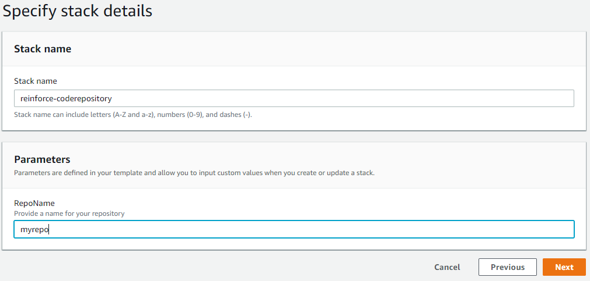

# Objective
In this module we will create a [CodeCommit](https://aws.amazon.com/codecommit/) repository to store our [Ansible](https://www.ansible.com/) playbook and supporting files. We will also download the workshop artifacts that contain the Ansible playbook and copy them to our local repository While this should work in any commercial region, it was tested specifically in US-East-1.

## Prerequisites

1. Ensure you are logged into an AWS account with admin access
2. AWS CLI set up on the local client.

## Create CodeCommit repository
We need to create a code repository to store our [Ansible](https://www.ansible.com/) playbook and supporting files. This will allow us to track changes to our playbook so that we can easily revert to a known working version if a change breaks a system. This will also integrate with [CodePipeline](https://aws.amazon.com/codepipeline/) in a later step to trigger our pipeline.

1. **Click** on the link below to launch the cloudformation template

    [us-east-1](https://console.aws.amazon.com/cloudformation/home?region=us-east-1#/stacks/new?stackName=reinforce-coderepository&templateURL=https://aws-reinforce-demo-grc341.s3.amazonaws.com/templates/code-repo.yml)

2. Name your repository

## Create IAM user

1. If you don't already have an IAM user, create one now from the [IAM console](https://console.aws.amazon.com/iam/home?region=us-east-1#/users)

2. Upload SSH public key or generate HTTPS credentials for your IAM user

## Clone your repository

1. Clone your repository using the Clone URL (HTTPS or SSH)

## Download workshop artifacts

1. Download [reinforce-demo.zip](https://aws-reinforce-demo-grc341.s3.amazonaws.com/reinforce-demo.zip)

2. Unzip reinforce-demo.zip and copy the contents to your local repository. The folder/file structure should look similar to below:

        /local-repo
          .git
          Ansible-RHEL7-CIS-Benchmarks-master
          scripts
          appspec.yml

**Note**: _Do not commit your files at this point. We will need to make changes to buildspec.yml in order for the solution to work._