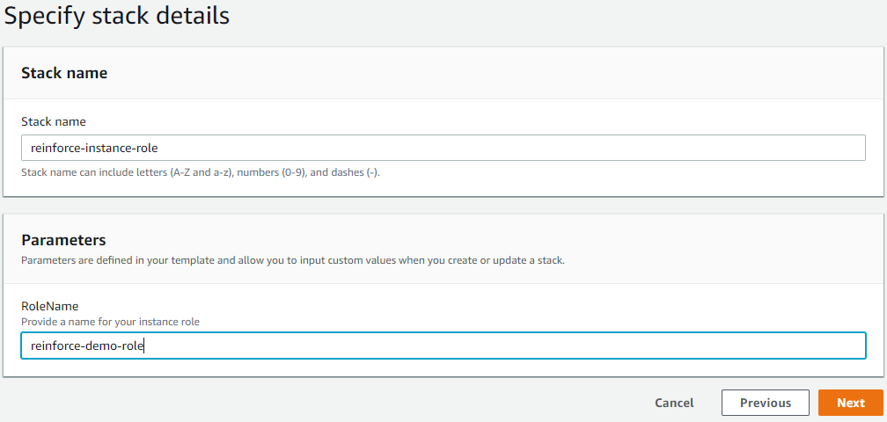
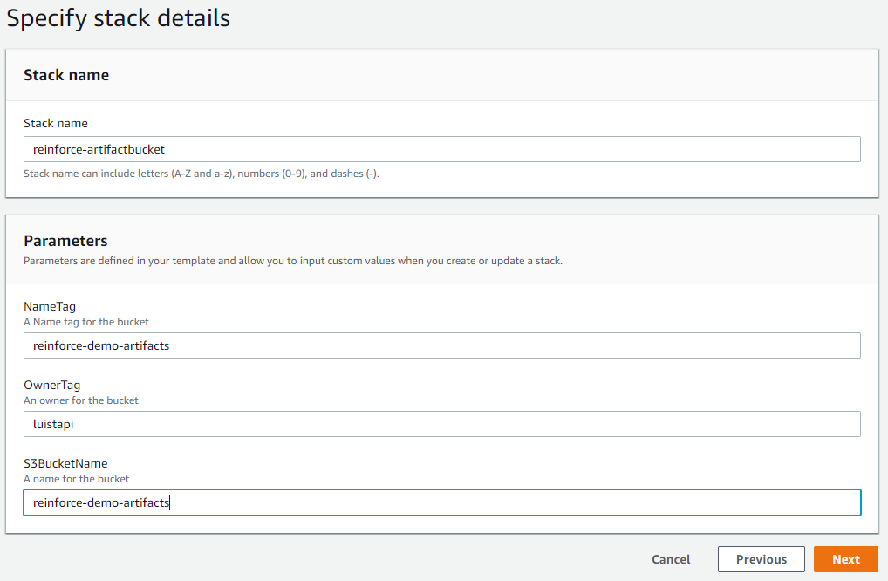
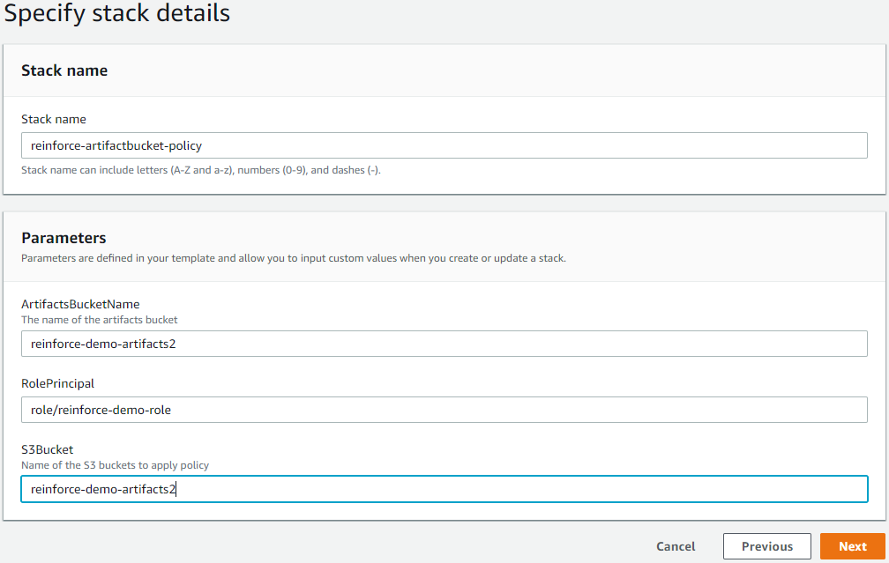
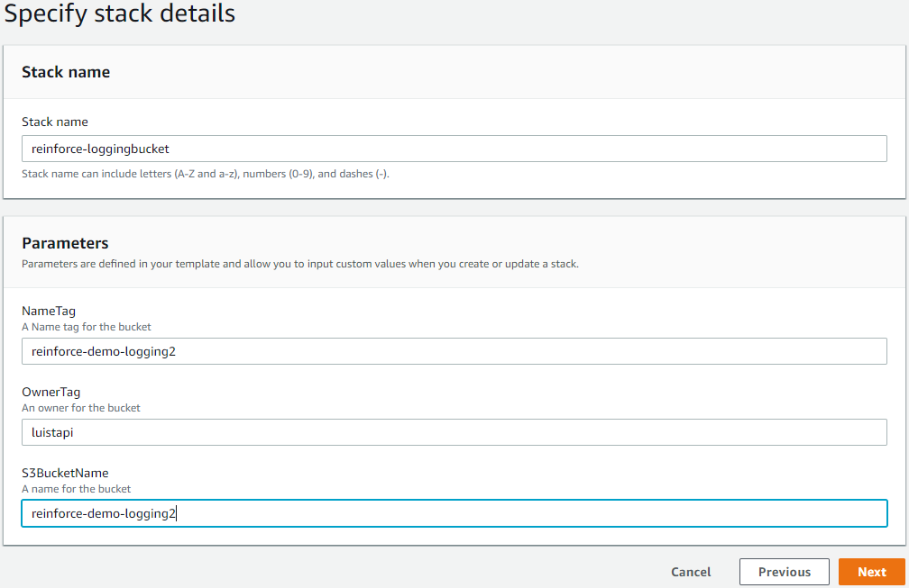
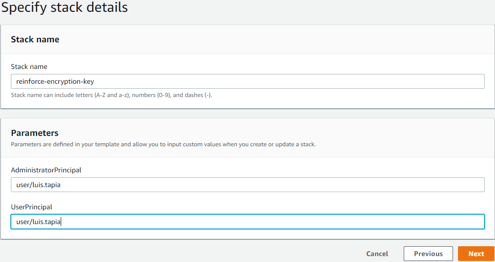

# Objective
In this module we will create [S3](https://aws.amazon.com/s3/) buckets to store build artifacts and logs. We will also create an encryption key that will be used to encrypt data at rest. Lastly, we will create an [IAM](https://aws.amazon.com/iam/) role that will give our [EC2](https://aws.amazon.com/ec2/) instance permissions for [Systems Manager](https://aws.amazon.com/systems-manager/). While this should work in any commercial region, it was tested specifically in US-East-1.

## Prerequisites

1. Ensure you are logged into an AWS account with admin access
2. AWS CLI set up on the local client.

## Create IAM role
We need to create a role for our instance so that it can download the [Ansible](https://www.ansible.com/) playbook from our artifacts bucket later.

1. **Click** on the link below to launch the cloudformation template

    [us-east-1](https://console.aws.amazon.com/cloudformation/home?region=us-east-1#/stacks/new?stackName=reinforce-instance-role&templateURL=https://aws-reinforce-demo-grc341.s3.amazonaws.com/templates/instance-role.yml)

2. Provide a name for your role



## Setting up S3 bucket for build artifacts
We will create an [S3](https://aws.amazon.com/s3/) bucket to store our artifacts. This will be used by [CodeBuild](https://aws.amazon.com/codebuild/) to store our build artifacts. The instance will reference this bucket later to download the [Ansible](https://www.ansible.com/) playbook. Make sure to fill in all of the parameters.

**NOTE**: _S3 bucket names are globally unique. If you get an error that a bucket already exists try a new name_

1. **Click** on the link below to launch the cloudformation template

    [us-east-1](https://console.aws.amazon.com/cloudformation/home?region=us-east-1#/stacks/new?stackName=reinforce-artifactbucket&templateURL=https://aws-reinforce-demo-grc341.s3.amazonaws.com/templates/artifact_bucket.yml)




In this step we are creating an S3 bucket policy and applying it to the bucket created in the previous step. This will grant the role created earlier access to download the artifacts. Make sure to fill in all of the parameters. The parameters ```ArtifactsBucketName``` and ```S3Bucket``` must match the name of the artifacts bucket created earlier. ```RolePrincipal``` must match the name of the IAM role created earlier.

2. **Click** on the link below to launch the cloudformation template

    [us-east-1](https://console.aws.amazon.com/cloudformation/home?region=us-east-1#/stacks/new?stackName=reinforce-artifactbucket-policy&templateURL=https://aws-reinforce-demo-grc341.s3.amazonaws.com/templates/bucket-policy.yml)



## Setting up S3 bucket for logging

We will now create an S3 bucket to store logs for troubleshooting purposes. If we encounter errors the logs may help us identify what went wrong. Make sure to fill in all of the parameters.

**NOTE**: _S3 bucket names are globally unique. If you get an error that a bucket already exists try a new name_

1. **Click** on the link below to launch the cloudformation template

    [us-east-1](https://console.aws.amazon.com/cloudformation/home?region=us-east-1#/stacks/new?stackName=reinforce-loggingbucket&templateURL=https://aws-reinforce-demo-grc341.s3.amazonaws.com/templates/logging_bucket.yml)

<<<<<<< HEAD


=======
>>>>>>> d0bb1bee0c857eb712726de6f38fecc7010c4d8a
## Create KMS Key for encryption

Here we will create a KMS encryption key that will be used by CodeBuild to encrypt our build artifacts in S3. Make sure to replace ```user/$user``` with the name of the IAM user created earlier. 

1. **Click** on the link below to launch the cloudformation template

    [us-east-1](https://console.aws.amazon.com/cloudformation/home?region=us-east-1#/stacks/new?stackName=reinforce-encryption-key&templateURL=https://aws-reinforce-demo-grc341.s3.amazonaws.com/templates/encryption.yml)

