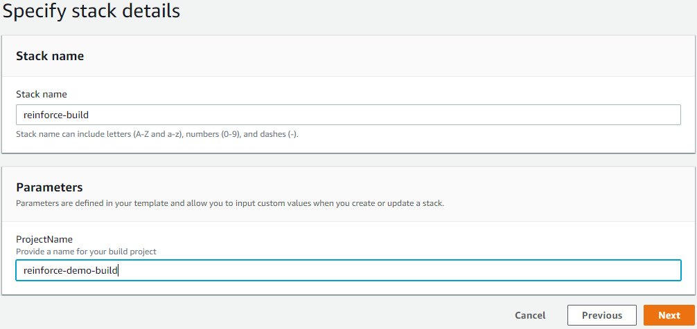

# Objective
In this module we will create a <a href="https://aws.amazon.com/codebuild/" target="_blank">AWS CodeBuild</a> Project to copy our files from our repository to S3. This will allow us to reference the playbook url in S3 in our Systems Manager State Manager association in a later step. While this should work in any commercial region, it was tested specifically in US-East-1.

## Prerequisites

1. Ensure you are logged into an AWS account with admin access
2. AWS CLI set up on the local client.

## Setting up your build project

We will create a <a href="https://aws.amazon.com/codebuild/" target="_blank">AWS CodeBuild</a> project that will take the code in our repository and create a zip file that CodeDeploy will use to deploy our <a href="https://www.ansible.com/" target="_blank">Ansible</a> playbook to our instances. Make sure to fill in all of the parameters.

2. **Click** on the link below to launch the cloudformation template

    <a href="https://console.aws.amazon.com/cloudformation/home?region=us-east-1#/stacks/new?stackName=reinforce-build&templateURL=https://aws-reinforce-demo-grc341.s3.amazonaws.com/templates/build.yml" target="_blank">us-east-1</a>

