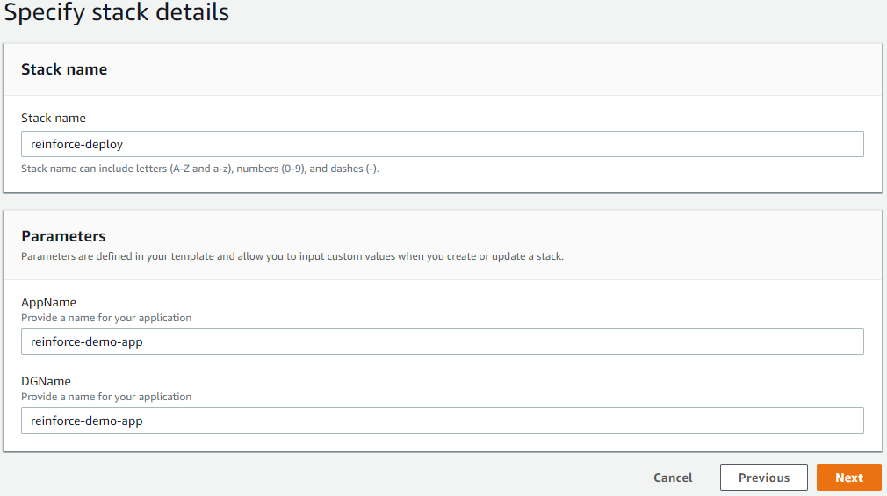

# Objective
In this module we will create a [CodeDeploy](https://aws.amazon.com/codedeploy/) application and deployment group. This will be used to deploy the Ansible playbook to our instance(s). While this should work in any commercial region, it was tested specifically in US-East-1.

## Prerequisites

1. Ensure you are logged into an AWS account with admin access
2. AWS CLI set up on the local client.

## Setting up your application and deployment group

We will create a [CodeDeploy](https://aws.amazon.com/codedeploy/) application and deployment group. The deployment group is used to define the target instances to deploy the artifacts to. Make sure to fill in all of the parameters.

1. **Click** on the link below to launch the cloudformation template

    [us-east-1](https://console.aws.amazon.com/cloudformation/home?region=us-east-1#/stacks/new?stackName=reinforce-deploy&templateURL=https://aws-reinforce-demo-grc341.s3.amazonaws.com/templates/deploy.yml)

