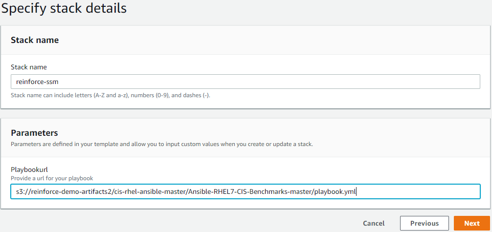

# Objective
In this module we will create a <a href="https://aws.amazon.com/systems-manager/" target="_blank">AWS Systems Manager</a> State Manager Association to run the Ansible playbook on our instance(s) every 30 mins. This is where we enforce the continuous hardening by ensuring that our instance(s) always has the latest configuration. While this should work in any commercial region, it was tested specifically in US-East-1.

## Prerequisites

1. Ensure you are logged into an AWS account with admin access
2. AWS CLI set up on the local client.

## Setting up the Systems Manager State Manager Association

Here we will create a <a href="https://aws.amazon.com/systems-manager/" target="_blank">AWS Systems Manager</a> State Manager association using the RunAnsiblePlaybook document. Systems Manager will reference the artifacts bucket created earlier to run the <a href="https://www.ansible.com/" target="_blank">Ansible</a> playbook. In this template we scheduled the association to run the playbook every 30 mins. This could be customized to meet your needs.

1. **Click** on the link below to launch the cloudformation template

    <a href="https://console.aws.amazon.com/cloudformation/home?region=us-east-1#/stacks/new?stackName=reinforce-ssm&templateURL=https://aws-reinforce-demo-grc341.s3.amazonaws.com/templates/ssm.yml" target="_blank">us-east-1</a>

3. The playbook url will be similar to:

        s3://YOUR_ARTIFACTS_BUCKET/cis-rhel-ansible-master/Ansible-RHEL7-CIS-Benchmarks-master/playbook.yml

