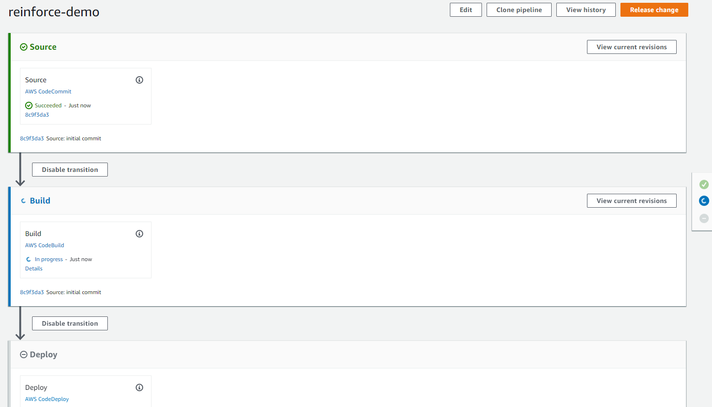

# Objective
In this module we will create the pipeline to autoomate the deployment of the Ansible playbook as changes are made.

## Prerequisites

1. Ensure you are logged into an AWS account with admin access
2. Completed all previous modules
3. Laptop with an IDE and git installed

## Create pipeline

1. In the ```Source``` stage, for ```Action Provider``` select ```AWS CodeCommit```
2. For ```Repository name``` select the repository created in module-1 from the drop down
3. For ```Branch name``` select the branch to monitor for changes from the drop down
4. In the ```Build``` stage, for ```Action Provider``` select ```AWS CodeBuild```
5. For ```Project name``` select the project created in module-3 from the drop down
6. In the ```Deploy``` stage, for ```Action Provider``` select ```AWS CodeDeploy```
7. For ```Application name``` select the application created in module-4 from the drop down
8. For ```Deployment group``` select the deployment group created in module-4 from the drop down
9. Review and create pipeline

Your pipeline should look similar to the below pipeline.

